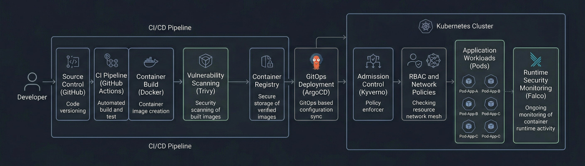
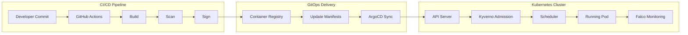

# Architecture Overview



**This diagram shows the end-to-end secure DevSecOps flow from code commit to runtime monitoring.**

This document explains the internal design of the Secure Kubernetes DevSecOps Platform and how each control contributes to end-to-end security.

---

## 1. System Design

The system is organized into five security zones:

1. **Source and Build Zone**
   - Developer commits code.
   - GitHub Actions builds and validates the container image.

2. **Supply Chain Trust Zone**
   - The image is scanned and signed.
   - The registry stores only deployable artifacts.

3. **GitOps Delivery Zone**
   - ArgoCD monitors the manifests repository.
   - Changes are applied declaratively to the cluster.

4. **Kubernetes Admission Zone**
   - Kyverno validates workloads before they are admitted.
   - Policies enforce trust and workload restrictions.

5. **Runtime Defense Zone**
   - Falco watches container activity in real time.
   - Suspicious behavior is detected and surfaced.

This separation mirrors how mature platform security teams think about defense-in-depth.

---

## 2. Component-Level Breakdown

### CI/CD Pipeline
GitHub Actions acts as the automation layer. It is responsible for:

- building the container image,
- scanning it for vulnerabilities,
- signing it using Cosign,
- pushing the image to the registry,
- and updating the deployment manifest with the new image tag.

The pipeline is intentionally split from the deployment engine. This prevents the CI system from becoming a direct deployment controller.

### Container Registry
The registry stores the built image. Its role is not only persistence, but also distribution of the signed artifact. The registry is part of the trust boundary because it becomes the source from which workloads are ultimately pulled.

### ArgoCD GitOps
ArgoCD watches the Git repository and continuously reconciles the desired state into the Kubernetes cluster. It is the delivery mechanism, but not the source of truth. Git remains the source of truth.

This matters because:
- it enables auditability,
- it supports rollback through Git history,
- and it avoids direct manual cluster changes.

### Kubernetes Cluster
The cluster hosts the workload and the security controls. Kubernetes is not treated as a passive runtime; it is a policy-enforced execution environment.

The cluster contains:
- application namespaces,
- system namespaces,
- RBAC controls,
- Network Policies,
- Kyverno admission controls,
- and Falco runtime detection.

### Kyverno Admission Controller
Kyverno is the policy engine used to validate incoming Kubernetes resources.

It is used for:
- blocking root or insecure containers,
- verifying image signatures,
- and preventing untrusted workloads from being admitted.

Kyverno sits at the front gate of the cluster and enforces policy before scheduling.

### Falco Runtime Engine
Falco runs as a node-level security sensor. It observes syscalls and container activity to detect suspicious behavior.

Falco is used because:
- not all attacks are visible during build or admission,
- runtime compromise can happen after a clean deployment,
- and syscall-level observation provides valuable threat signals.

---

## 3. Step-by-Step Request Flow

### Flow Diagram


### Detailed Flow

#### Step 1: Developer Pushes Code
A code change is committed to GitHub. This is the trigger for the automation chain.

#### Step 2: GitHub Actions Builds the Image
The CI job builds a container image from the Dockerfile.

#### Step 3: Scan Phase
Trivy or Grype scans the image for vulnerabilities. High-risk findings can fail the pipeline.

#### Step 4: Sign Phase
Cosign signs the image, creating a verifiable trust artifact.

#### Step 5: Registry Push
The trusted image is published to the registry.

#### Step 6: GitOps Manifest Update
The deployment manifest is updated to reference the exact image tag.

#### Step 7: ArgoCD Sync
ArgoCD detects the Git change and applies the manifest to the cluster.

#### Step 8: Kyverno Admission
Kyverno inspects the workload. If the image is unsigned or the pod violates policy, the request is denied.

#### Step 9: Runtime Monitoring
Once the workload is live, Falco monitors activity for suspicious behavior.

---

## 4. Security Enforcement Points

### Build-Time Security
Security starts in CI with scanning and signing.

Controls:
- vulnerability scanning,
- dependency review,
- artifact signing.

Purpose:
- prevent insecure images from being published.

### Deployment-Time Security
GitOps and admission control govern deployment.

Controls:
- ArgoCD reconciliation,
- Kyverno validation,
- approved manifest changes only.

Purpose:
- prevent manual drift and unauthorized workload admission.

### Runtime Security
Falco provides runtime detection.

Controls:
- syscall inspection,
- container behavior monitoring,
- suspicious event generation.

Purpose:
- detect attacks that appear only after deployment.

---

## 5. Why Each Tool Is Used

### GitHub Actions
Used for build automation and security checks in CI.

### Trivy
Used to detect known vulnerabilities before the image is trusted for deployment.

### Cosign
Used to ensure artifact integrity and provenance.

### ArgoCD
Used to enforce GitOps and ensure deployments are pulled from declarative configuration.

### Kyverno
Used to block insecure or untrusted workloads at admission time.

### Falco
Used to detect suspicious runtime activity that bypasses build-time controls.

### Kubernetes RBAC
Used to limit who can access or modify cluster resources.

### Network Policies
Used to limit lateral movement and reduce communication paths between workloads.

---

## 6. Textual Architecture Diagram
```mermaid
flowchart TB

subgraph CI/CD Pipeline
A[Developer Push] --> B[GitHub Actions]
B --> B1[Build]
B1 --> B2[Scan]
B2 --> B3[Sign]
B3 --> B4[Push Image]
end

B4 --> C[Container Registry]

subgraph GitOps Delivery
C --> D[GitOps Repo (Kubernetes Manifests)]
D --> E[ArgoCD Sync]
end

subgraph Kubernetes Cluster
E --> F[API Server]
F --> F1[Kyverno Admission]
F1 --> G[Running Pod]

G --> G1[RBAC Controls]
G --> G2[Network Policies]

G --> H[Falco Runtime Monitoring]
end
```

---

## 7. Design Decisions

### Why GitOps Instead of kubectl apply
GitOps provides:
- auditability,
- declarative configuration,
- rollback via Git,
- and reduced manual cluster access.

### Why Kyverno for Admission
Kyverno is Kubernetes-native and expressive for policy enforcement. It is a strong fit for teams that want policy-as-code without writing custom controllers.

### Why Falco for Runtime
Falco is well suited for cloud-native runtime detection because it can detect behavior rather than just configuration.

### Why Separate CI from CD
Separating CI from CD reduces risk. The build system should not directly become the deploy authority. GitOps ensures deployment decisions are visible and reviewable.

---

## 8. Security Posture Summary

This architecture secures the system at three levels:

- **Artifact security** through scanning and signing,
- **Admission security** through policy enforcement,
- **Runtime security** through behavioral detection.

That combination is what makes the design enterprise-grade.

---

## 9. Operational Notes

In real deployments, system namespaces such as `kube-system` and security tool namespaces such as `falco` often require carefully scoped policy exceptions. This is not a security weakness; it is a necessary design choice to avoid blocking trusted cluster infrastructure.

---

## 10. Final Outcome

The final result is a secure, auditable, and production-style Kubernetes deployment pipeline that demonstrates how enterprise DevSecOps teams protect containerized applications from build to runtime.
