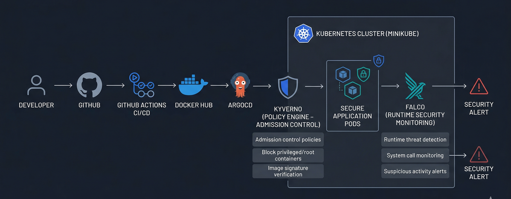
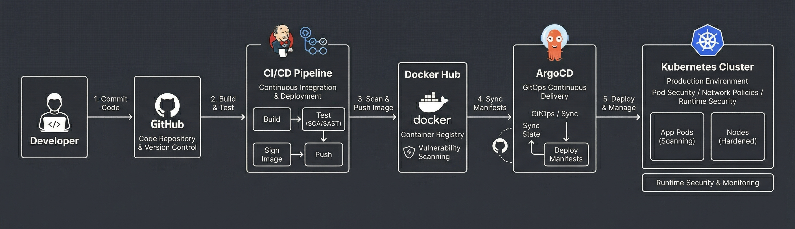
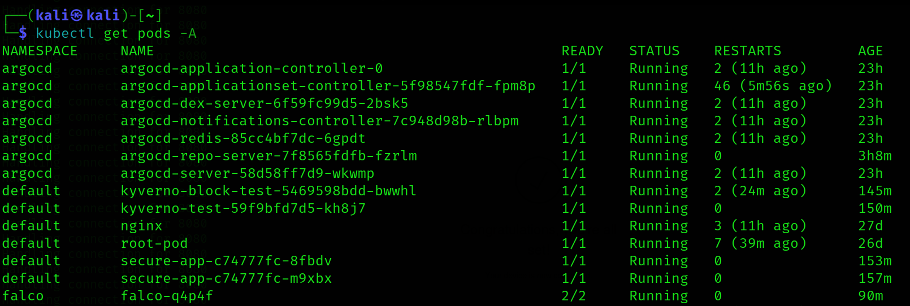
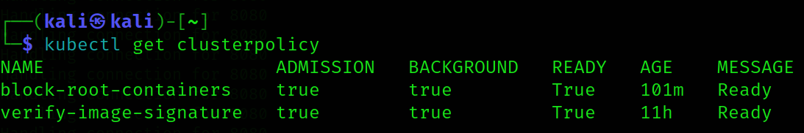
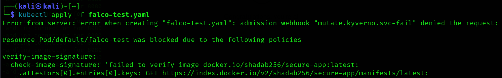
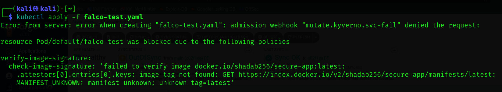
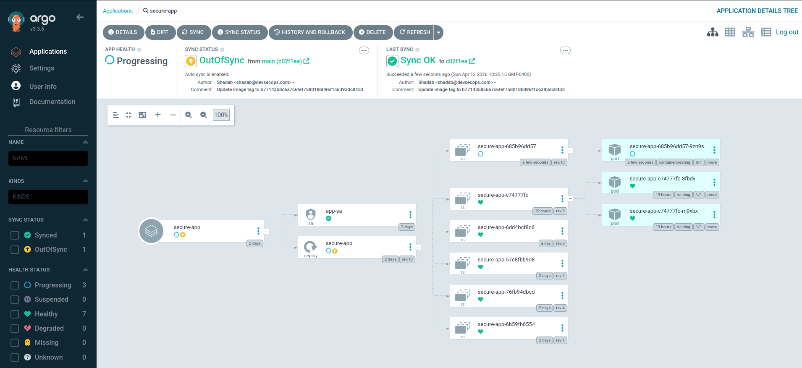
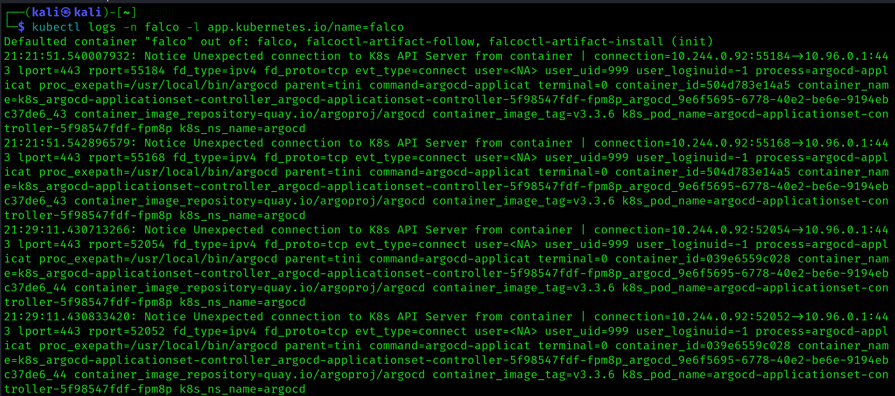

# 🛡️ Secure Container Deployment using Kubernetes + DevSecOps


A production-grade **DevSecOps security architecture** built on Kubernetes that enforces security at every stage of the container lifecycle — from image verification to runtime threat detection.

This project demonstrates how modern enterprises secure containerized workloads using **policy-as-code, runtime security, and GitOps automation**.

---

## 🎯 Key Objectives

- Enforce non-root container execution  
- Verify container image authenticity  
- Detect runtime threats in real-time  
- Implement GitOps-based secure deployment  
- Build enterprise-grade Kubernetes security pipeline  

---

## 📌 Key Highlights

- 🔒 Enforced zero-trust container deployment using Kyverno  
- 🚫 Blocked insecure workloads at admission level  
- 🔍 Detected runtime anomalies using Falco  
- 🔁 Implemented GitOps-based continuous deployment  
- ⚡ Achieved real-time security monitoring inside Kubernetes  
---

## 🏗️ Architecture Overview



Include:

- Developer pushing code to GitHub  
- GitHub Actions CI/CD pipeline  
- Docker image build and push to Docker Hub  
- ArgoCD pulling manifests (GitOps)  
- Kubernetes cluster (Minikube)  

Inside Kubernetes include:
- Kyverno (Policy Engine)
- Falco (Runtime Security)
- Secure Application Pods

### Flow:


### Security Layers:
- Kyverno (Admission Control: block root containers, verify image signature)  
- Falco (Runtime threat detection)

Use glowing neon colors (blue, purple, red highlights) on a dark background.  
Make it clean, modern, enterprise-level diagram.

---
## 🛡️ Security Layers Breakdown

| Layer              | Tool            | Purpose                          |
|-------------------|----------------|----------------------------------|
| CI/CD             | GitHub Actions | Secure build pipeline            |
| Image Security    | Kyverno        | Verify image signatures          |
| Admission Control | Kyverno        | Block insecure pods              |
| Runtime Security  | Falco          | Detect live threats              |
| GitOps            | ArgoCD         | Secure deployments               |

---

## ⚙️ Tech Stack

- Kubernetes (Minikube)  
- Kyverno – Policy as Code  
- Falco – Runtime Threat Detection  
- ArgoCD – GitOps Deployment  
- Docker – Containerization  
- GitHub Actions – CI/CD Pipeline  

---

## 🔐 Security Implementation

### 1️⃣ Kyverno Policies (Admission Control)

✔ Block root containers  
✔ Enforce security best practices  
✔ Verify container image signatures  

Example:

```yaml
securityContext:
  runAsNonRoot: true
```

👉 Prevents insecure containers from being deployed.

---

## 2️⃣ Image Signature Verification

- Only trusted images are allowed  
- Prevents tampered or malicious containers  
- Enforced using Kyverno `verifyImages` policy  

---

## 3️⃣ Runtime Security with Falco

Falco continuously monitors system calls and detects:

- Suspicious API server connections  
- Privilege escalation attempts  
- Unauthorized process execution  

### Example Alert:

```text
Unexpected connection to K8s API Server from container
```

👉 Real-time threat detection 🔥

---

## 🔁 GitOps Workflow

- Developer pushes code to GitHub  
- CI/CD pipeline builds Docker image  
- Image pushed to Docker Hub  
- ArgoCD syncs Kubernetes manifests  
- Kyverno enforces security policies  
- Falco monitors runtime behavior  

---

## 📂 Project Structure

```text
secure-container-kubernetes-devsecops/
│
├── .github/
│   └── workflows/
│       └── ci.yaml
│
├── argocd/
│   └── application.yaml
│
├── app/
│   ├── app.py
│   ├── Dockerfile
│   └── requirements.txt
│
├── k8s/
│   ├── base/
│   │   ├── deployment.yaml
│   │   └── service-account.yaml
│   │
│   └── security/
│       ├── kyverno-policy.yaml
│       ├── network-policy.yaml
│       └── rbac.yaml
│
├── security/
│   ├── falco/
│   │   └── falco-rules.yaml
│   │
│   └── kube-bench/
│       └── job.yaml
│
├── .gitignore
└── README.md


````
## 🧪 Security Testing

---

### 🚫 Test 1: Root Container Block

**Attempted Deployment:**

```yaml
runAsNonRoot: false
```
---

❌ **Result:**

```text
admission webhook denied request
```
---

### 🚫 Test 2: Unsigned Image Block

❌ **Result:**

```text
failed to verify image signature
```
---

### 🔍 Test 3: Runtime Threat Detection

**Falco Detection:**

```text
Unexpected connection to K8s API Server
```
---

### ✅ Result:

Runtime security system successfully detected malicious behavior in real time.

---
## ⚡ How to Run This Project

### 1. Start Kubernetes Cluster

```bash
minikube start
```
### 2. Install Kyverno

```bash
kubectl create -f https://github.com/kyverno/kyverno/releases/latest/download/install.yaml
```
### 3. Install Falco

```bash
helm install falco falcosecurity/falco -n falco --create-namespace
```
### 4. Install ArgoCD

```bash
kubectl create namespace argocd
kubectl apply -n argocd -f https://raw.githubusercontent.com/argoproj/argo-cd/stable/manifests/install.yaml
```
### 5. Apply Security Policies

```bash
kubectl apply -f k8s/security/
```


## 📸 Screenshots

---

### 🔹 Kubernetes Cluster Overview



👉 Shows all running components including Kyverno, Falco, ArgoCD, and application pods.

---

### 🔹 Kyverno Policies



👉 Displays active cluster policies enforcing security rules.

---

### 🔹 Policy Enforcement (Blocking Root Container) 🚫



👉 Kyverno successfully blocks insecure deployment attempts.

---

### 🔹 Image Signature Verification Failure 🚫



👉 Unsigned or untrusted images are denied at admission level.

---

### 🔹 ArgoCD GitOps Dashboard



👉 Shows automated deployment and sync status from Git repository.

---

### 🔹 Falco Runtime Alerts 🔥



👉 Real-time detection of suspicious container behavior.

---

## 📊 Results

- ✅ 100% policy enforcement at admission level  
- ✅ Real-time runtime threat detection  
- ✅ Secure GitOps-based deployment  
- ✅ Enterprise-ready Kubernetes security stack  

---

## ⚠️ Challenges Faced

- Docker Hub rate limiting during image verification  
- Kyverno policy conflicts with system namespaces  
- Falco DaemonSet requiring privileged access  

---

## 🧠 Learnings

- Kubernetes security operates in multiple layers: code → build → deploy → runtime  
- Policy-as-Code prevents misconfigurations before deployment  
- Runtime security is critical for detecting live threats in production environments  
- GitOps improves consistency, traceability, and rollback safety  

---

## 🚀 Future Enhancements

- Integrate SIEM platforms (Splunk / ELK Stack) for centralized logging and monitoring  
- Add Falco alerting via Slack / Webhook notifications for real-time response  
- Compare Kyverno with OPA Gatekeeper for policy enforcement evaluation  
- Add vulnerability scanning using Trivy / Grype in CI/CD pipeline  
- Implement image signing using Cosign (Sigstore) for supply chain security assurance  

---

## 🙏 Acknowledgement

Special thanks to:

- Open-source Kubernetes community  
- Cloud-native ecosystem contributors  
- Enterprise DevSecOps best practices  