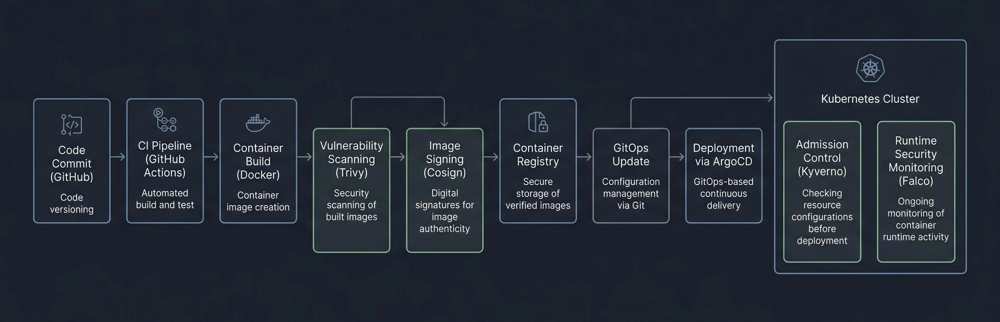

# Secure Kubernetes DevSecOps Platform


A production-grade Kubernetes security implementation that combines **GitHub Actions, container scanning, image signing, GitOps deployment, policy enforcement, and runtime threat detection** into a single end-to-end workflow.


This project demonstrates how modern teams secure containerized workloads in real-world environments where speed, traceability, and defense-in-depth must coexist. It is designed to reflect how enterprise DevSecOps teams protect the software supply chain and the Kubernetes runtime from build time to production.

---

## Executive Summary

Most Kubernetes deployments fail security not because teams do nothing, but because they secure only one stage of the lifecycle. A container may be scanned during CI, but later deployed manually without verification. A cluster may be hardened, but still accept unsigned images. A workload may be admitted safely, but later abused at runtime.

This project addresses that gap.

It implements a complete Kubernetes DevSecOps control plane where:

- code is built through GitHub Actions,
- images are scanned for vulnerabilities,
- artifacts are signed using Cosign,
- deployments are managed through ArgoCD and GitOps,
- Kubernetes admission is enforced with Kyverno,
- and runtime threats are observed with Falco.

The result is a realistic security architecture that protects the container lifecycle across **build, distribution, deployment, admission, and runtime**.

---

## Problem Statement

Kubernetes is powerful, but it expands the attack surface significantly when security is treated as an afterthought.

Common risks include:

- vulnerable container images entering production,
- unsigned or tampered images being deployed,
- privileged or root containers escaping isolation,
- uncontrolled pod-to-pod communication,
- direct kubectl-based changes bypassing change control,
- and malicious runtime behavior that appears only after deployment.

In many organizations, these issues are the reason for container incidents, cluster compromise, and failed compliance audits.

This project models the controls enterprise teams use to reduce those risks.

---

## Solution Overview

The solution uses layered security controls to enforce trust and reduce blast radius at each stage:

- **CI** builds and scans the container image.
- **Cosign** signs the image to prove artifact integrity.
- **ArgoCD** deploys through GitOps, not manual cluster access.
- **Kyverno** blocks insecure workloads and verifies image signatures.
- **Falco** monitors runtime activity for suspicious behavior.
- **Kubernetes RBAC and Network Policies** restrict access and lateral movement.

This creates a defense-in-depth design where one control does not replace another.

---

## Architecture Overview

The architecture separates responsibilities across the software lifecycle:

1. **Developer pushes code** to GitHub.
2. **GitHub Actions** builds the container image.
3. **Trivy or Grype** scans the image for known vulnerabilities.
4. **Cosign** signs the image after the build and scan succeed.
5. The image is pushed to a **container registry**.
6. **ArgoCD** watches the Git repository and syncs Kubernetes manifests.
7. **Kyverno** validates the workload at admission time.
8. The workload runs inside **Kubernetes** with restricted permissions.
9. **Falco** continuously observes runtime behavior and raises alerts on suspicious activity.


This architecture reflects a real enterprise pattern: **secure supply chain plus secure runtime**.

---

## DevSecOps Pipeline Flow



### 1. Developer Commit
A developer pushes application code to the repository.

### 2. Build Stage
GitHub Actions builds a container image from the Dockerfile.

### 3. Vulnerability Scan
The image is scanned using Trivy or Grype to detect known CVEs in the OS layer and application dependencies.

### 4. Image Signing
Cosign signs the image to create a cryptographic trust relationship between the build system and the artifact.

### 5. Registry Push
The signed image is pushed to a container registry.

### 6. GitOps Update
Kubernetes manifests are updated to reference the new image tag.

### 7. ArgoCD Sync
ArgoCD detects the Git change and applies the updated manifests to the cluster.

### 8. Admission Enforcement
Kyverno validates the workload before it is admitted into the cluster.

### 9. Runtime Monitoring
Falco monitors system calls and container behavior for suspicious activity.

---

## Security Layers

| Layer | Tooling | Purpose |
|---|---|---|
| Source Control | GitHub | Code change tracking and review |
| Build | GitHub Actions | Automated container build |
| Vulnerability Scanning | Trivy / Grype | Detect known CVEs |
| Supply Chain Integrity | Cosign | Sign container images |
| Deployment Automation | ArgoCD | GitOps-based delivery |
| Admission Control | Kyverno | Block insecure workloads |
| Cluster Hardening | RBAC, NetworkPolicy | Limit access and movement |
| Runtime Security | Falco | Detect live threats |
| Audit and Traceability | Git + Kubernetes events | Track every change |

---

## Threat Model

This project is designed around the most relevant container and Kubernetes threats.

### Threats Addressed

- **Unsigned image deployment**
  - Prevented by Kyverno signature verification.
- **Tampered image in registry**
  - Reduced by Cosign signatures and admission verification.
- **Privileged container execution**
  - Reduced by non-root enforcement and security context restrictions.
- **Lateral movement inside the cluster**
  - Reduced by Network Policies.
- **Unauthorized cluster changes**
  - Reduced by GitOps and ArgoCD.
- **Runtime compromise**
  - Detected by Falco.
- **Cluster misconfiguration**
  - Reduced by Kubernetes policy enforcement and RBAC.

### Security Assumptions

- The Git repository is controlled and reviewed.
- The registry is trusted, but image integrity must still be verified.
- Cluster-admin access is tightly restricted.
- Runtime detection is necessary because build-time scanning cannot stop every attack.

---

## Before vs After Security Comparison

| Scenario | Before This Project | After This Project |
|---|---|---|
| Deploying images | Manual or loosely controlled | Signed and verified |
| Kubernetes changes | Direct kubectl access | GitOps-controlled |
| Root containers | Often allowed by default | Blocked by policy |
| Image authenticity | Not guaranteed | Verified with Cosign + Kyverno |
| Runtime visibility | Minimal | Falco detects suspicious behavior |
| Audit trail | Fragmented | Centralized in Git and Kubernetes events |

---

## Tools & Tech Stack

- **Kubernetes / Minikube** for local cluster deployment
- **Docker** for image packaging
- **GitHub Actions** for CI automation
- **Trivy / Grype** for vulnerability scanning
- **Cosign** for image signing
- **ArgoCD** for GitOps deployment
- **Kyverno** for admission control and policy-as-code
- **Falco** for runtime threat detection

---

## Implementation Details

### Kyverno Policies

Kyverno enforces cluster policy at admission time. This project includes policies that:

- block root containers,
- restrict insecure security contexts,
- verify that only signed images are admitted.

This is important because build-time security does not matter if an attacker can still deploy an untrusted image.

### Image Signing

Cosign is used to cryptographically sign images after build and scan stages succeed. The signature establishes provenance and helps prevent unauthorized or tampered images from reaching production.

### Falco Runtime Detection

Falco monitors runtime activity and detects suspicious behavior such as:

- shell execution inside containers,
- unexpected file access,
- abnormal process behavior,
- and actions that resemble privilege escalation or compromise.

Falco provides the last line of defense when an attack bypasses build-time controls.

---


## Repository Structure

```text
secure-container-kubernetes-devsecops/
│
├── .github/
│   └── workflows/
│       └── ci.yaml
│
├── argocd/
│   └── application.yaml
│
├── app/
│   ├── app.py
│   ├── Dockerfile
│   └── requirements.txt
│
├── k8s/
│   ├── base/
│   │   ├── deployment.yaml
│   │   └── service-account.yaml
│   │
│   └── security/
│       ├── kyverno-policy.yaml
│       ├── network-policy.yaml
│       └── rbac.yaml
│
├── security/
│   ├── falco/
│   │   └── falco-rules.yaml
│   │
│   └── kube-bench/
│       └── job.yaml
│
├── .gitignore
├── Architecture.md
└── README.md
```

---

## How to Run

### 1. Start the cluster
```bash
minikube start
```

### 2. Install ArgoCD
```bash
kubectl create namespace argocd
kubectl apply -n argocd -f https://raw.githubusercontent.com/argoproj/argo-cd/stable/manifests/install.yaml
```

### 3. Install Kyverno
```bash
kubectl create namespace kyverno
kubectl apply -f https://github.com/kyverno/kyverno/releases/latest/download/install.yaml
```

### 4. Install Falco
```bash
helm repo add falcosecurity https://falcosecurity.github.io/charts
helm install falco falcosecurity/falco --namespace falco --create-namespace
```

### 5. Apply cluster policies
```bash
kubectl apply -f k8s/security/
```

### 6. Sync with ArgoCD
```bash
kubectl apply -f argocd/application.yaml
```

---

## Screenshots


### 🔹 Kubernetes Cluster Overview


👉 Shows all running components including Kyverno, Falco, ArgoCD, and application pods.

---

### 🔹 Kyverno Policies


👉 Displays active cluster policies enforcing security rules.

---

### 🔹 Policy Enforcement (Blocking Root Container) 🚫


👉 Kyverno successfully blocks insecure deployment attempts.

---

### 🔹 Image Signature Verification Failure 🚫


👉 Unsigned or untrusted images are denied at admission level.

---

### 🔹 ArgoCD GitOps Dashboard


👉 Shows automated deployment and sync status from Git repository.

---

### 🔹 Falco Runtime Alerts 🔥


👉 Real-time detection of suspicious container behavior.

---

## Testing & Validation

The project was validated through security tests that demonstrated enforcement at multiple stages.

### Admission Control Test
A deployment using an unsigned or invalid image was blocked by Kyverno.

### Non-Root Enforcement Test
A workload attempting to run without the required security context was rejected.

### Runtime Security Test
A test workload was used to trigger Falco alerts through suspicious container activity.

These tests prove that the pipeline does not just build and deploy, but actively enforces security expectations.

---

## Challenges & Fixes

### Docker Hub Rate Limiting
While testing image verification, Docker Hub rate limiting impacted unauthenticated pulls. This was resolved by authenticating Docker access.

### Kyverno Policy Conflicts
Falco required elevated access, which conflicted with strict non-root policies. The solution was to exclude trusted system namespaces and handle policy scope carefully.

### Falco Initialization on Minikube
Falco required runtime driver setup and eBPF compatibility. This was resolved by using an appropriate Falco installation mode and validating cluster compatibility.

These are realistic operational issues, not toy-project issues, which makes the project more interview-relevant.

---

## Results & Impact

This project demonstrates:

- secure image lifecycle control,
- policy-based Kubernetes admission enforcement,
- GitOps deployment discipline,
- runtime threat detection,
- and layered cluster hardening.

It models how enterprise teams reduce risk without sacrificing deployment speed or traceability.

---

## Real-world Use Cases

This architecture is relevant to:

- **Fintech and banking platforms** where trust and compliance matter,
- **SaaS platforms** where rapid delivery must remain safe,
- **Healthcare systems** handling regulated workloads,
- **Enterprise internal platforms** where multiple teams share Kubernetes infrastructure.

Any organization running containers at scale can use these patterns to reduce supply chain and runtime risk.

---

## Future Enhancements

Possible next-stage improvements include:

- integration with Slack, webhook, or SIEM alerting,
- centralized log aggregation with ELK or Splunk,
- OPA Gatekeeper comparison for policy evaluation,
- image promotion workflows across dev, staging, and production,
- multi-cluster GitOps,
- and automated remediation for runtime threats.

---

## Project Summary

This project implements a secure Kubernetes deployment architecture using GitOps, container signing, policy enforcement, and runtime monitoring. It demonstrates an enterprise-style DevSecOps workflow that protects the container lifecycle from code commit to runtime execution. The system combines GitHub Actions, Trivy or Grype, Cosign, ArgoCD, Kyverno, and Falco to enforce security across build, supply chain, deployment, admission, and runtime layers.

---
